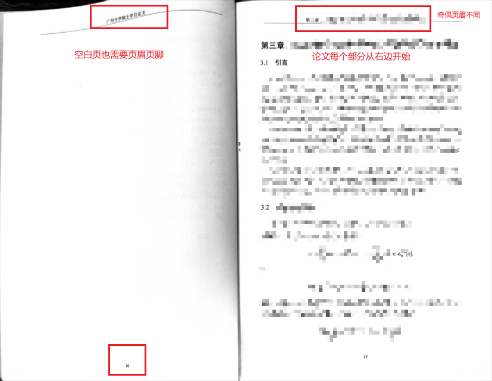
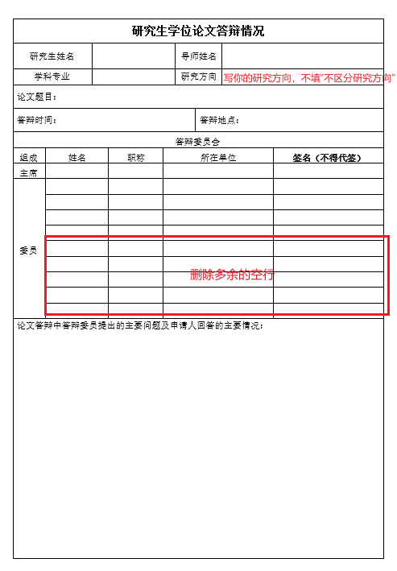
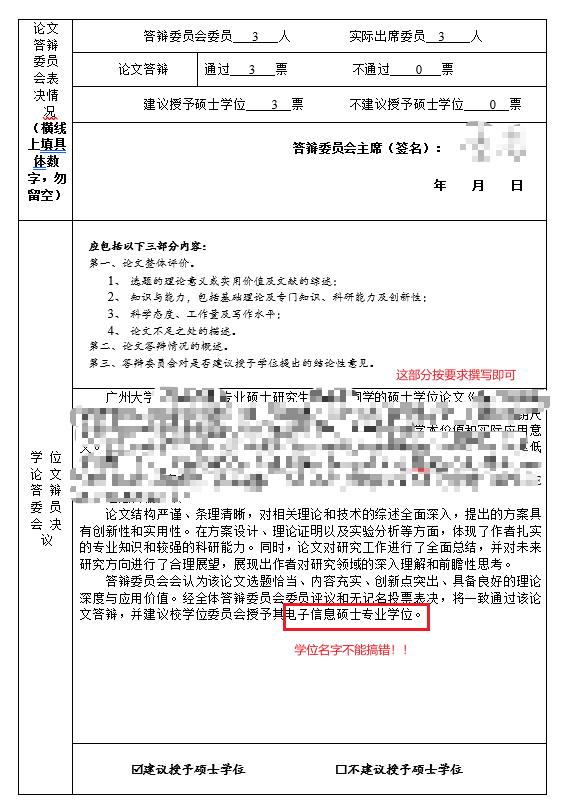

## 引言

本项目是为了弥补广州大学计算机科学与网络工程学院学位管理方面，在材料收集整理时缺乏具体文件处理的操作指引的问题。为避免学生因材料文本或格式有问题多次奔波，项目中给出了研究生三年学位相关基本流程，并说明了各环节容易踩坑的地方。

### 研究生三年你会接触的老师

研究生期间，除了导师以外，每个研究生还会接触另外两位行政方面的老师。
- 辅导员：一般兼党支部书记，有任何学业，生活，就业，同学之间的矛盾，学院事务，入党，学籍档案，考公考编政审相关问题，请找辅导员
- 学位办老师：处理学位相关材料，包括研究生论文开题，中期考核，答辩，学位授予材料。每个学生有1个培养档案袋（记录研究生培养过程材料，证明培养是否合规，授予毕业证的证明材料）和1个学位档案袋（记录研究生学位能力，授予学位证的证明材料），可以将学位办老师理解为管理每个学生这两个档案袋的人。

### 材料基本问题

- 日期时间：关键材料的日期时间是确定的，如学位申请表上填写的答辩日期必须和线下答辩的日期一致；多个材料之间时间要保持一致，如中期考核的时间必然在开题报告之后。
- 签名：大部分学位相关材料都需要导师签名，除此之外，开题报告，中期考核，预答辩，答辩，都需要多个老师签名，需要自行和老师协调时间签名
- 排版：大部分材料没有硬性的排版要求，在可调整范围内，应当调整得好看一些。如可以删除空行来让内容排版到一页的，应当排版到一页，方便打印、签名或盖章。入档案的材料中有空白的部分，比如表格中的空行，可以删除掉再打印，或者打印出来之后用签字笔划线表示内容为空。
- 字体、字号：如果没有明确规定字体字号的，一般中文使用宋体，英文使用Times New Roman，标题使用黑体；正文字号使用小四。
- 材料模板：所有相关材料，去[广州大学研究生院网站](https://yjsy.gzhu.edu.cn/xzzx.htm)下载。

## 选课

按学位办老师的要求选课，并完成课程，拿到课程学分即可。
课程时间冲突相关问题请咨询学位办老师。

## 论文开题

论文开题一般定在研二上学期或下学期，如当年12月底或隔年3~4月。

开题结束后需要提交的材料包括：
- 开题报告3份
- 中期考核2份

上面两份材料的纸质版**盖学院章**后，要进行拍照或扫描，整理成2个PDF文件，分别上传研究生系统/培养管理/开题报告和中期考核处，个人提交成功后，提醒导师在系统里完成审批。
注意：中期考核的日期是开题报告日期的一周内。

两张盖章成绩单放到中期考核表后面。成绩单“中期考核”位置，手写“通过”二字。

## 中期考核

略。

## 毕业前培养档案袋材料提交

一般会在研三下学期（大约3月份）提交全部培养材料，包括：
- 学术活动登记表
- 参与学术活动心得报告（3份）
- 读书报告登记表
- 读书报告（6份）
- 实践考核表(专硕是实习计划表+实践考核表；学硕是教学/社会实践考核表）
- 学位论文中期报告1份（参加论文中期报告教师（要求副高以上职称的教师不少于三人）签名；+导师签名）
- 培养工作记录本1份（绿色封皮的本子，每一页需要写满，字可以写大一点，可以留出一定空白空间。底部每页都要有导师签名，可以用导师的签字章。严禁代签！！）（日期写到2025.3.30）
- 每学年研究生个人总结（共3份）

## 毕业预答辩

由导师联系定一个日期，举行预答辩会议，结束后提交“预答辩意见书”，需要预答辩组的3位副教授以上职称的老师签名。

## 查重和外审（盲审）

论文撰写完成后，提交学校的学位申请系统查重，通过查重后即可申请送审。
由于学院系统只有1次查重机会，所以可以先在知网查重，并查AIGC率，通过后，再提交学院查重。

送审后，外校专家会在10个工作日内给出评审意见，分为A, B, C, D四个等级。评审结果有1个C，则论文由学位办老师重新送审，若送审结果仍为C，则取消答辩资格。评审结果有1个D，直接取消答辩资格。

结果出来后，可在系统中下载“论文评阅书”。

## 毕业答辩（重要！）

学位办老师会定好答辩时间，一般在5月10日到5月20日，学院统一组织答辩。
全体学生分组完成答辩，每个答辩委员会由3位答辩老师组成，1位外校专家担任答辩委员会组长，每个答辩委员会同时配备一名答辩秘书（不过可能啥也不干）。
答辩前每个学生需要自己准备好以下材料：
- 论文评阅书3份（每个老师一份）
- 论文修改说明书3份（需要先找导师签字。答辩时每位答辩老师一人一份）
- 学位论文3份（每个答辩老师给一份，非正式，黑白打印，订书机订一下）
- 学位论文封面（扉页）打印4份（答辩结束后答辩组签字，后期胶装论文用）
- 学位申请表2份（当场记录答辩老师提问和你的回答，可以当场打印签字，或者后期手写补上老师提问）（打印需要答辩老师签字的最后4页就可以）（答辩结束后签字）

答辩前，该小组参与答辩的学生派一个学生代表去学位办老师处领取“答辩表决票”。

答辩过程需要录像和拍照，录像要求拍到答辩ppt展示屏幕，学生正脸，答辩组老师的背影或者侧脸。答辩照片1~2张，需要拍到学生正脸，答辩组正脸或侧脸。两个材料是为了证明该学生的确进行了答辩过程。

答辩的提问环节，其他同学要帮忙记录老师提问，答辩结束后写在学位申请表上。

全体学生答辩结束后，答辩委员会讨论是否授予学位，此时其他人回避。

答辩委员会讨论结束后，全体学生站成一排，由答辩委员会组长宣读结果。宣读过程需要录像，最后全体合照。答辩老师和答辩秘书在表决票上签名，在学生材料上签名。

## 答辩结束后材料整理（重要）

提交时间为全体学生答辩结束后2周内（大约5月27日~5月29日）
- 封装纸质版论文4本（1本学生自留，1本送图书馆，2本放学院。导师一般都要完整论文的PDF电子版），可以去大学城校区行政东楼一楼打印社（图书馆正门斜对面处）打印，博士限额150元，硕士限额100元
- 学位申请表2份（成绩单由学位办老师提供）
- 论文自查明细表1份
- 学位评审登记表
- 预答辩申请表
- 学位获得者基本信息表（研究生管理系统填写导出）

注意：到了答辩时，都默认有了研究方向，请不要填“不区分研究方向”

### 论文封装时会出现的问题

- 打印出来的论文，每个独立部分都是从右手边（奇数页）开始的，包括封面、摘要、英文摘要、目录、正文章节、参考文献和致谢（阅读的时候从右手边开始）
- 摘要、英文摘要、目录部分页脚使用罗马数字
- 正文的每一页（包括空白页）都要有页眉和页脚
- 奇数页的页眉为该章节标题，偶数页页眉为“广州大学硕士学位论文”几个字
- 可以黑白打印

### 学位申请表重要部分

这一页需要多个老师的签名，所以非常重要！研究方向不要写错，答辩委员会多余的空行要删除掉（没删除打印出来用签字笔划掉也可以）

#### 注意

论文封装非常重要！一旦错误，需要拆开后重新装订，非常麻烦，往年曾有同学装订3次！

## 学位证和毕业证

6月拿学位证和毕业证。

## Q&A

Q：学院有什么资源？
A：就业季学院会和企业、学校对接来学院招聘，及时看群里辅导员通知即可。平时也会偶尔更新实习相关信息。